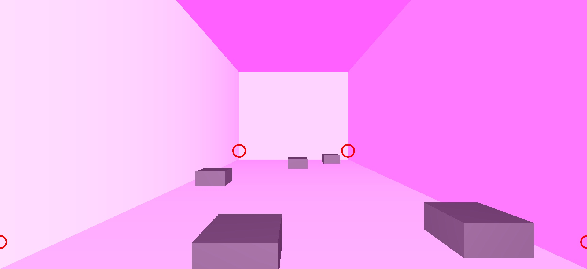
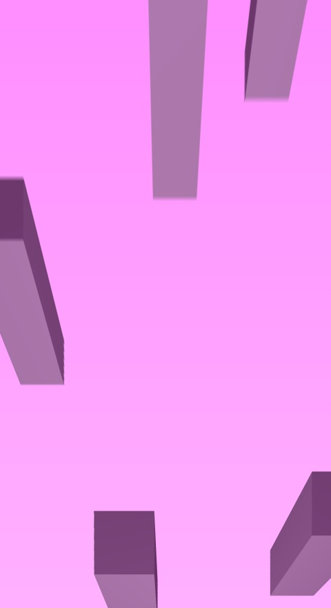
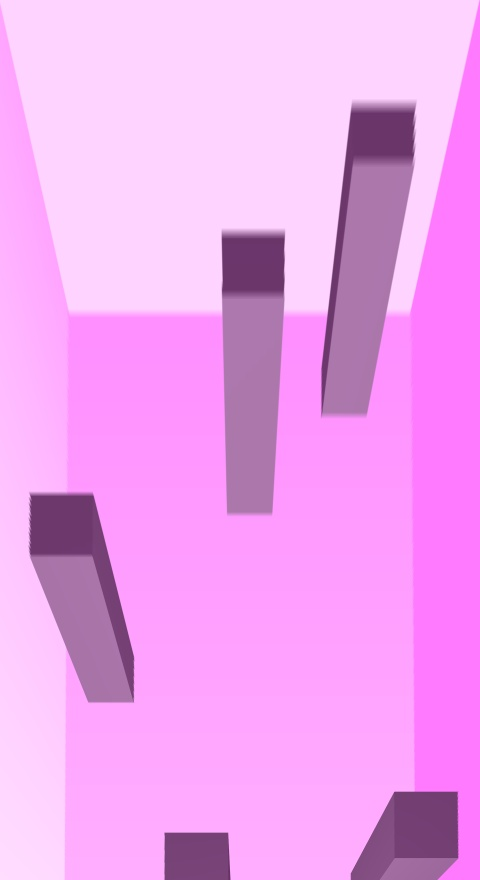
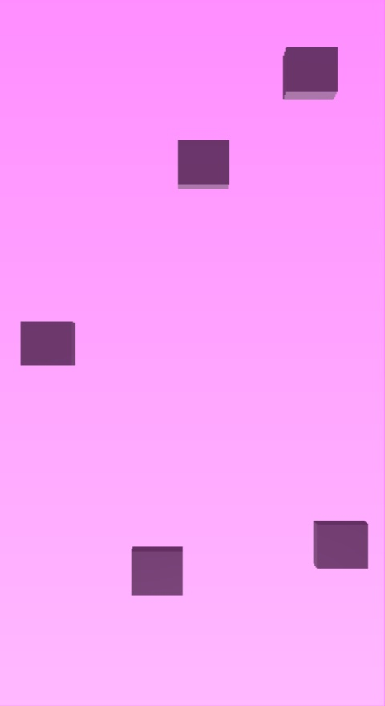

# Classroom Photogrammetry
 
This repository is focused on developing some solution that can take pictures from university classrooms and turn them into 2d top-down maps, labeling desks, and adding measurements for covid-19 mitigation.

#  Ideas
Note: The images taken from the small webgl sim are used to consistantly test different ways to approach the problem (removing a lot of variables between hardware and humans). 

## Perspective warp

By doing a simple perspective warp of image at the 2 visable corners of when the floor meets the two walls and the two visable bottom of the image

This results in an image that isnt consistant with what is needed (top down)

The persective warp seems to be useful when the heights of the cubes are actually zero (a rectangle). This conveys that of the points taken for the perspective warp relate to height of the cubes/objects of interest.

## Perspective warp at a specific plane

If we assume that every object of interest in the picture is the same height (the desks are usually the same size except in large lecture rooms) then we can grab the points (from the wall, relative to the height of the desks/objects) to reconstruct a plane. This plane is really important, if we do a perspective warp at that specific plane, we can get the same results as using rectangles (as opposed to using cubes)

This perspective warp is far better than the previous method because it is much closer to the ground truth

The only *problem* with this method is that we still lose the data right infront of the observer due to their elevation. The hardest challenge is reconstructing the plane that runs across the top edges of the objects.